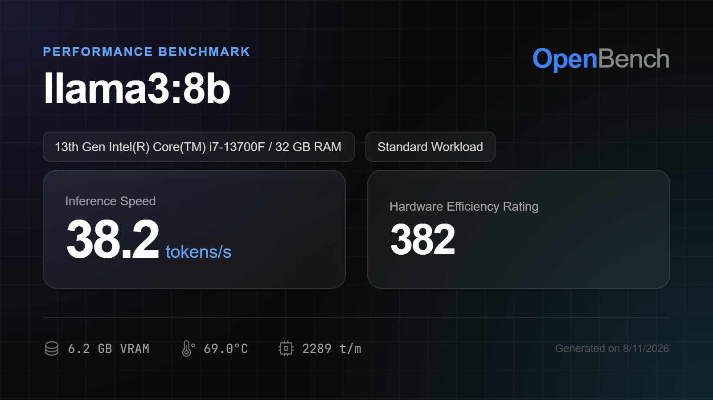

<div align="center">
  

  # OpenBench

  **The ultimate desktop hardware and LLM benchmarking suite.**
  
  <p>
    <a href="https://github.com/tauri-apps/tauri"></a>
    <a href="https://reactjs.org/"></a>
    <a href="https://rust-lang.org/"></a>
  </p>

  <p>
    <em>Stop guessing how your hardware performs. Start testing it.</em>
  </p>
</div>

<br />

> **OpenBench** is a lightning-fast, beautifully designed desktop application built with Tauri, React, and Rust. It connects to your local LLM engines (like Ollama) and puts your CPU, GPU, and RAM through absolute hell to see exactly what they're capable of.

> [!WARNING]
> **Hardware Support:** OpenBench currently only supports **Windows OS** and **NVIDIA GPUs** for live hardware telemetry tracking. 

<br />

<div align="center">
  
</div>

---

### Why OpenBench?

Most benchmarking tools are either entirely terminal-based, incredibly complex to configure, or strictly cloud-only. **OpenBench** brings enterprise-grade grid search and live hardware telemetry into a stunning, glassmorphic desktop app. 

Whether you're testing a new RTX 4090, pushing an M3 Max to its limits, or just trying to figure out which local model is fastest on your setup, OpenBench gives you the exact metrics you need.

<br />

### Core Features

<table>
  <tr>
    <td width="50%">
      <h4>Live Hardware Telemetry</h4>
      <p>Watch your GPU VRAM and core temperatures spike in real-time as models generate tokens. No more waiting until the end to see how your hardware held up.</p>
    </td>
    <td width="50%">
      <h4>LLM-as-a-Judge</h4>
      <p>Don't just measure speed. Measure intelligence. Use a massive model (like Llama 3 70B) to automatically grade the reasoning capabilities of smaller, faster models.</p>
    </td>
  </tr>
  <tr>
    <td width="50%">
      <h4>Bring Your Own Data (BYOD)</h4>
      <p>Drop your own `.txt`, `.csv`, or `.json` files into the arena. OpenBench instantly parses them and runs your models against your proprietary datasets.</p>
    </td>
    <td width="50%">
      <h4>Social Scorecards</h4>
      <p>Export gorgeous, stylized PNG scorecards of your benchmark runs to easily share your hardware flexes on Twitter, Reddit, and GitHub.</p>
    </td>
  </tr>
</table>

<br />

<div align="center">
  
</div>

<br />

### The Workloads

OpenBench doesn't just ask "say hi". We've engineered brutally difficult workloads to test context limits and generation stability:

- **Standard (Chat):** From basic quantum physics explanations to deep socioeconomic essays.
- **Context (NIAH):** Needle-In-A-Haystack tests injecting massive token arrays to test attention heads.
- **Code Generation:** From basic Python scripts to complete, multithreaded x86 bootloaders.
- **Latency (TTFT):** Bare-metal Time-To-First-Token measurements.

<br />

### Getting Started

OpenBench requires **Node.js**, **Rust**, and a local LLM runner like **Ollama** installed on your system.

```bash
# 1. Clone the repository
git clone https://github.com/your-username/openbench.git
cd openbench

# 2. Install frontend dependencies
npm install

# 3. Fire up the application
npm run tauri dev
```

<br />

### The Scoring System

OpenBench calculates a proprietary performance score based on three critical vectors:
1. **Speed:** Tokens per second (Heavy Weight)
2. **Thermal Efficiency:** Average component temperatures (Medium Weight)
3. **Memory Footprint:** Peak VRAM consumption (Penalty Weight)

```javascript
Score = (TPS * 10) + (100 - Temp) - (VRAM * 5)
```

<br />

<div align="center">
  <p>Built with ❤️ by Krish Shah and the open-source community.</p>
  <p><b>Star the repo if this was helpful! ⭐</b></p>
  <br />
  <a href="https://star-history.com/#Krshs90/OpenBench&Date">
    <picture>
      <source media="(prefers-color-scheme: dark)" srcset="https://api.star-history.com/svg?repos=Krshs90/OpenBench&type=Date&theme=dark" />
      <source media="(prefers-color-scheme: light)" srcset="https://api.star-history.com/svg?repos=Krshs90/OpenBench&type=Date" />
      
    </picture>
  </a>
</div>
